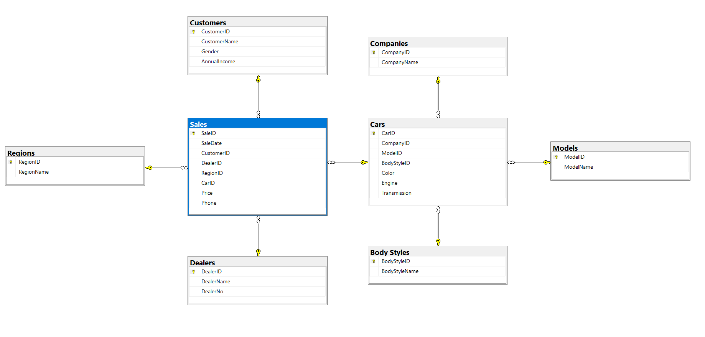

# Car Sales Database Design

SQL Server database design project based on a car sales dataset.

This project demonstrates how a flat transactional dataset can be transformed into a relational database structure using SQL Server, primary keys, foreign keys, lookup tables, and an entity relationship diagram.

## Project Overview

The original dataset contained car sale transactions with customer information, dealer details, car specifications, regions, prices, and sale dates.

The main goal of this project was to design a relational database that separates repeated information into dedicated tables and makes the data easier to query, maintain, and analyze in future SQL, Python, and Power BI work.

## Dataset

The original dataset included 16 columns and 23,906 rows. I took it from Kaggle: https://www.kaggle.com/datasets/missionjee/car-sales-report?select=Car+Sales.xlsx+-+car_data.csv

For this public portfolio version, the repository includes a 200-row sample dataset. Customer names and phone numbers were anonymized before publishing.

Main dataset fields include:

- Sale date
- Customer information
- Dealer information
- Dealer region
- Car company and model
- Body style
- Engine and transmission
- Color
- Sale price

## Database Structure

The database design separates the original flat data into the following tables:

- **Customers** — customer name, gender, and annual income
- **Regions** — dealer regions
- **Dealers** — dealer name and dealer number
- **Companies** — car manufacturers and brands
- **Models** — car model names
- **Body Styles** — body style categories
- **Cars** — car specifications and references to company, model, and body style
- **Sales** — sale transactions connecting customers, dealers, regions, and cars

## Entity Relationship Diagram

The database diagram shows the relationship between the main entities in the project.



## Tools & Technologies

- Microsoft SQL Server
- SQL
- Relational database design
- Primary keys and foreign keys
- Entity relationship diagram
- CSV dataset preparation

## Key Features

- Created a SQL Server database from a flat car sales dataset
- Designed normalized relational tables
- Defined primary keys and foreign key relationships
- Loaded lookup tables using distinct values from the staging dataset
- Connected sales transactions to customers, dealers, regions, and cars
- Created an ERD to visualize the database structure
- Prepared a public anonymized dataset sample

## Repository Structure

```text
Car-Sales-Database-Design/
├── README.md
├── sql/
│   └── car_sales_database.sql
├── data/
│   └── car_sales_sample.csv
├── docs/
│   └── project_documentation.md
└── images/
    └── database_diagram.png
```

## Files

- `sql/car_sales_database.sql` — original SQL script written for the project
- `data/car_sales_sample.csv` — anonymized 200-row sample dataset
- `docs/project_documentation.md` — cleaned project documentation for GitHub
- `images/database_diagram.png` — database relationship diagram

## Notes

The SQL script is kept in the original learning style used during the course. The public dataset sample was cleaned only for privacy and readability before publishing.

## What I Learned

Through this project, I practiced:

- Database planning
- Table design
- Data modeling
- SQL Server syntax
- Primary and foreign key relationships
- Normalizing a flat dataset
- Preparing a project for future analysis work
